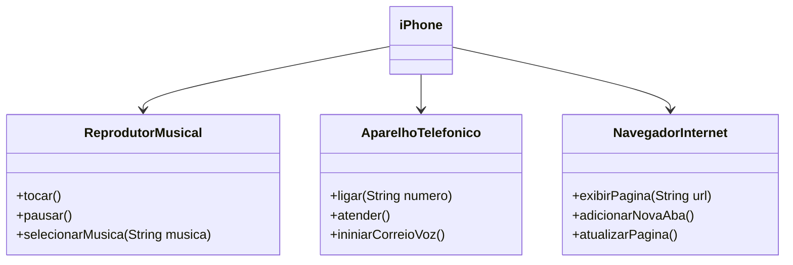

# UML-Iphone-DIO

## POO - Desafio

### Modelagem 

Nesta atividade tive o desafio de criar através do padrão UML de diagramação de um "Iphone", o qual possuia as seguintes funcionalidades:

#### Funcionalidades a Modelar
1. **Reprodutor Musical**
    - Métodos: `tocar()`, `pausar()`, `selecionarMusica(String musica)`
2. **Aparelho Telefônico**
    - Métodos: `ligar(String numero)`, `atender()`, `iniciarCorreioVoz()`
3. **Navegador na Internet**
    - Métodos: `exibirPagina(String url)`, `adicionarNovaAba()`, `atualizarPagina()`

### Diagramação do Iphone

